# Playwright POM Framework - Architecture & Execution Flow

---

## Table of Contents

1. [High-Level Architecture](#1-high-level-architecture)
2. [Class Hierarchy Diagram](#2-class-hierarchy-diagram)
3. [Interceptor Pipeline](#3-interceptor-pipeline)
4. [UI Test Execution Flow](#4-ui-test-execution-flow)
5. [API Test Execution Flow](#5-api-test-execution-flow)
6. [Parallel API Execution](#6-parallel-api-execution)
7. [Fixture Dependency Graph](#7-fixture-dependency-graph)
8. [Sequence Diagrams](#8-sequence-diagrams)
9. [UI vs API Comparison](#9-ui-vs-api-comparison)
10. [Detailed Phase Breakdown](#10-detailed-phase-breakdown)

---

## 1. High-Level Architecture

```
+--------------------------------------------------------------+
|                      TEST LAYER                              |
|  login.spec.ts | auth-api.spec.ts | parallel-api.spec.ts     |
|  shared-token-api.spec.ts | e2e.spec.ts                     |
+--------------------------------------------------------------+
|                    FIXTURE LAYER                             |
|  test:    base -> auth -> data -> logging (auto)             |
|  apiTest: apiAuth -> data -> logging (auto)  [parallel-safe] |
+-----------------------------+--------------------------------+
|     PAGE OBJECTS            |      API CLIENTS               |
|  LoginPage                  |  AuthAPI (workerIndex?)        |
|  DashboardPage              |  UserAPI (workerIndex?)        |
|  CartPage                   |  OrderAPI (workerIndex?)       |
|  CheckoutPage               |                                |
|  OrdersPage                 |                                |
+-----------------------------+--------------------------------+
|     BasePage                |      BaseAPI                   |
|  (abstract)                 |  (abstract, workerIndex?)      |
|                             |  + RequestInterceptor          |
|                             |  + ResponseInterceptor         |
|                             |  + TokenManager                |
+-----------------------------+--------------------------------+
|                SHARED SERVICES                               |
|  Logger (Singleton)  |  ConfigManager (Singleton)            |
|  TokenManager        |  (worker + shared token management)   |
+--------------------------------------------------------------+
|                PLAYWRIGHT ENGINE                             |
|  Page | APIRequestContext | Browser | BrowserContext         |
+--------------------------------------------------------------+
```

Each layer depends only on the layer below it. Tests never call Playwright APIs directly - they go through Page Objects or API Clients.

---

## 2. Class Hierarchy Diagram

```mermaid
classDiagram
    direction TB

    class BasePage {
        <<abstract>>
        #page: Page
        #logger: Logger
        +abstract path: string
        +navigate() Promise~void~
        +waitForPageLoad() Promise~void~
        +getTitle() Promise~string~
        +getCurrentUrl() Promise~string~
        +takeScreenshot(name) Promise~Buffer~
        #click(locator) Promise~void~
        #fill(locator, value) Promise~void~
        #getText(locator) Promise~string~
        #isVisible(locator) Promise~boolean~
        #selectOption(locator, value) Promise~void~
        #uploadFile(locator, path) Promise~void~
    }

    class LoginPage {
        +path: string
        -emailInput: Locator
        -passwordInput: Locator
        -loginButton: Locator
        -errorToast: Locator
        +login(email, password) Promise~void~
        +getErrorMessage() Promise~string~
        +isLoginButtonVisible() Promise~boolean~
        +clickRegister() Promise~void~
    }

    class DashboardPage {
        +path: string
        -productCards: Locator
        -cartButton: Locator
        -searchInput: Locator
        +addProductToCart(name) Promise~void~
        +goToCart() Promise~void~
        +getProductNames() Promise~string[]~
        +getCartCount() Promise~number~
        +signOut() Promise~void~
    }

    class CartPage {
        +path: string
        -cartItems: Locator
        -checkoutBtn: Locator
        +isProductInCart(name) Promise~boolean~
        +checkout() Promise~void~
    }

    class CheckoutPage {
        +path: string
        -countryInput: Locator
        -placeOrderBtn: Locator
        +selectCountry(prefix) Promise~void~
        +placeOrder() Promise~void~
        +getConfirmationMessage() Promise~string~
    }

    class OrdersPage {
        +path: string
        +navigate() Promise~void~
    }

    class BaseAPI {
        <<abstract>>
        #request: APIRequestContext
        #logger: Logger
        #workerIndex?: number
        +constructor(request, workerIndex?)
        +setWorkerIndex(workerIndex) void
        -getRequestHeaders() Record~string, string~
        -maskHeaders(headers) Record~string, string~
        -attachRequest(method, endpoint, headers, data?) Promise~void~
        -attachResponse(response) Promise~void~
        #get~T~(endpoint, params?) Promise~T~
        #post~T~(endpoint, data?) Promise~T~
        #put~T~(endpoint, data?) Promise~T~
        #patch~T~(endpoint, data?) Promise~T~
        #delete~T~(endpoint) Promise~T~
        #getRaw(endpoint, params?) Promise~APIResponse~
        -handleResponse~T~(response) Promise~T~
    }

    class AuthAPI {
        +constructor(request, workerIndex?)
        +login(credentials) Promise~LoginResponse~
        +loginShared(credentials) Promise~LoginResponse~
        +register(data) Promise~RegisterResponse~
    }

    class UserAPI {
        +constructor(request, workerIndex?)
        +registerUser(data) Promise~RegisterResponse~
        +getUserDetails(userId) Promise~UserResponse~
    }

    class OrderAPI {
        +constructor(request, workerIndex?)
        +getAllProducts() Promise~ProductListResponse~
        +createOrder(data) Promise~CreateOrderResponse~
        +getOrdersForCustomer(userId) Promise~OrderListResponse~
        +deleteOrder(orderId) Promise~object~
    }

    class RequestInterceptor {
        <<static>>
        -static token: string | null
        -static logger: Logger
        +static setAuthToken(token) void
        +static clearAuthToken() void
        +static getHeaders() Record~string, string~
        +static setWorkerAuthToken(workerIndex, token) void
        +static clearWorkerAuthToken(workerIndex) void
        +static setSharedAuthToken(token) void
        +static clearSharedAuthToken() void
        +static getWorkerHeaders(workerIndex?) Record~string, string~
    }

    class TokenManager {
        <<static>>
        -static workerTokens: Map~number, string~
        -static sharedToken: string | null
        -static logger: Logger
        +static setWorkerToken(workerIndex, token) void
        +static getWorkerToken(workerIndex) string | null
        +static clearWorkerToken(workerIndex) void
        +static setSharedToken(token) void
        +static getSharedToken() string | null
        +static clearSharedToken() void
        +static resolveToken(workerIndex?) string | null
        +static clearAll() void
    }

    class ResponseInterceptor {
        <<static>>
        -static logger: Logger
        +static logResponse(response) Promise~void~
        +static isSuccess(response) boolean
        +static isClientError(response) boolean
        +static isServerError(response) boolean
        +static extractErrorMessage(response) Promise~string~
    }

    class Logger {
        <<singleton>>
        -static instance: Logger
        -winstonLogger: winston.Logger
        +static getInstance() Logger
        +info(message) void
        +warn(message) void
        +error(message) void
        +debug(message) void
    }

    class ConfigManager {
        <<singleton>>
        -static instance: ConfigManager
        -config: EnvironmentConfig
        +static getInstance() ConfigManager
        +getConfig() EnvironmentConfig
        +get~K~(key) EnvironmentConfig[K]
    }

    BasePage <|-- LoginPage
    BasePage <|-- DashboardPage
    BasePage <|-- CartPage
    BasePage <|-- CheckoutPage
    BasePage <|-- OrdersPage
    BaseAPI <|-- AuthAPI
    BaseAPI <|-- UserAPI
    BaseAPI <|-- OrderAPI

    BaseAPI ..> RequestInterceptor : getHeaders() / getWorkerHeaders()
    BaseAPI ..> ResponseInterceptor : handleResponse()
    AuthAPI ..> RequestInterceptor : setAuthToken() / setWorkerAuthToken() / setSharedAuthToken()
    RequestInterceptor ..> TokenManager : resolveToken() / setWorkerToken() / setSharedToken()
    BasePage ..> Logger : uses
    BaseAPI ..> Logger : uses
```

### Inheritance Summary

| Base Class | Pattern | Subclasses | Purpose |
|------------|---------|------------|---------|
| `BasePage` (abstract) | Page Object Model | `LoginPage`, `DashboardPage`, `CartPage`, `CheckoutPage`, `OrdersPage` | Browser UI interactions |
| `BaseAPI` (abstract) | API Client + Interceptors | `AuthAPI`, `UserAPI`, `OrderAPI` | REST API calls with auto headers + worker-aware tokens |

### Singletons

| Singleton | Purpose | Access |
|-----------|---------|--------|
| `Logger` | Winston logging to console + file | `Logger.getInstance()` |
| `ConfigManager` | Environment-specific configuration | `ConfigManager.getInstance()` |

### Static Managers

| Class | Purpose | Access |
|-------|---------|--------|
| `TokenManager` | Per-worker + shared token storage for parallel execution | `TokenManager.resolveToken(workerIndex)` |
| `RequestInterceptor` | Header management with worker-aware token injection | `RequestInterceptor.getWorkerHeaders(workerIndex)` |

---

## 3. Interceptor Pipeline

The interceptor pattern centralizes request headers and response processing. `BaseAPI` uses both interceptors automatically - API clients never handle headers or response parsing directly. In parallel mode, `TokenManager` resolves worker-scoped tokens. Every HTTP method is wrapped in `test.step()` for Allure step nesting, and request/response details are attached as JSON to the report.

```mermaid
flowchart LR
    subgraph Request Pipeline
        A["API Client Method\n(e.g. orderAPI.getAllProducts)"] --> B["BaseAPI.post()"]
        B --> B_STEP["test.step('POST /endpoint')"]
        B_STEP --> B0{"workerIndex\nset?"}
        B0 -- Yes --> C2["RequestInterceptor\n.getWorkerHeaders(workerIndex)"]
        B0 -- No --> C["RequestInterceptor\n.getHeaders()"]
        C2 --> C3["TokenManager\n.resolveToken(workerIndex)"]
        C3 --> C4{"worker token\nexists?"}
        C4 -- Yes --> D["Headers:\nContent-Type: application/json\nAuthorization: worker-token"]
        C4 -- No --> C5{"shared token\nexists?"}
        C5 -- Yes --> D3["Headers:\nContent-Type: application/json\nAuthorization: shared-token"]
        C5 -- No --> D2["Headers:\nContent-Type: application/json"]
        C --> C1{"Token set?"}
        C1 -- Yes --> D
        C1 -- No --> D2
        D --> ATT_REQ["attachRequest()\ntest.info().attach('Request',\n{method, url, maskedHeaders, body})"]
        D2 --> ATT_REQ
        D3 --> ATT_REQ
        ATT_REQ --> E["Playwright\nrequest.post(endpoint,\n{ headers, data })"]
    end

    subgraph Response Pipeline
        E --> F["APIResponse"]
        F --> ATT_RES["attachResponse()\ntest.info().attach('Response',\n{status, url, body})"]
        ATT_RES --> G["ResponseInterceptor\n.logResponse()"]
        G --> H{"isSuccess?\n(2xx)"}
        H -- Yes --> I["response.text()\nJSON.parse(body)\nreturn typed T"]
        H -- No --> J{"isClientError?\n(4xx)"}
        J -- Yes --> K["extractErrorMessage()\nlogger.error(Client Error)\nthrow Error"]
        J -- No --> L{"isServerError?\n(5xx)"}
        L -- Yes --> M["extractErrorMessage()\nlogger.error(Server Error)\nthrow Error"]
    end
```

### Token Resolution Priority

```
TokenManager.resolveToken(workerIndex?)
  1. Worker-scoped token (workerTokens.get(workerIndex))  ← highest priority
  2. Shared token (sharedToken)                           ← fallback
  3. Legacy static token (RequestInterceptor.token)       ← backward compatible
  4. null (no Authorization header)                       ← no auth
```

### Token Lifecycle (Legacy - Single Token)

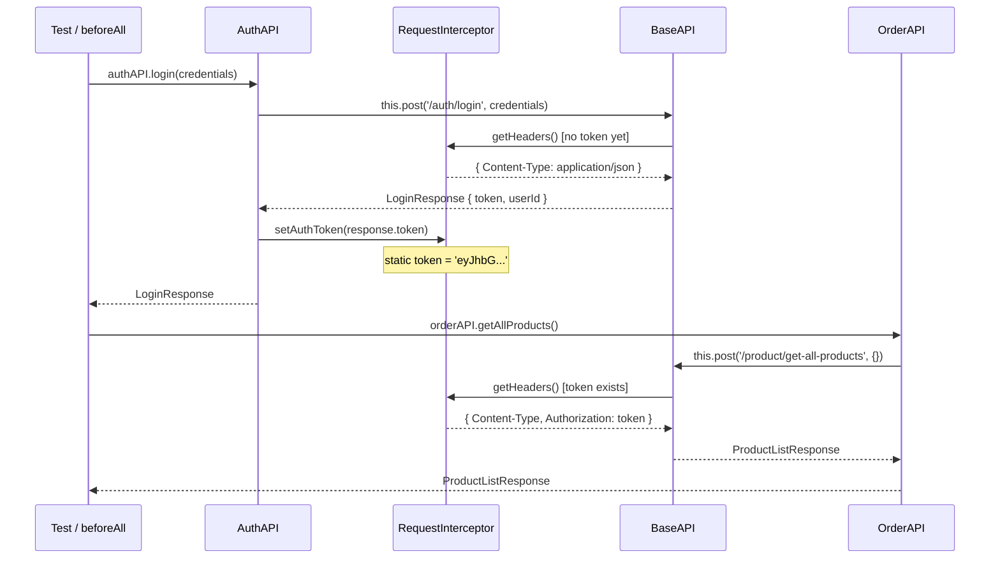

### Token Lifecycle (Parallel - Worker-Scoped Tokens)

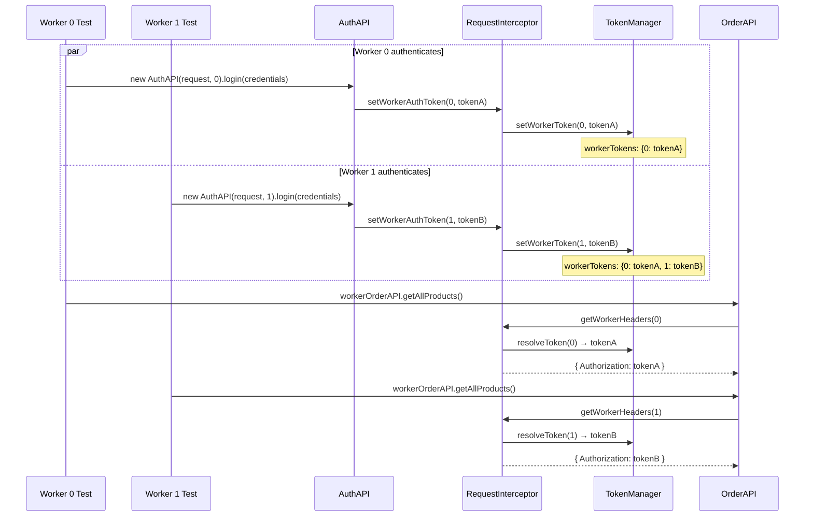

**Key**: Each worker gets its own token stored by `workerIndex`. No cross-contamination between parallel workers.

---

## 4. UI Test Execution Flow

Traces the full method call chain from `npx playwright test` through test completion for a UI test.

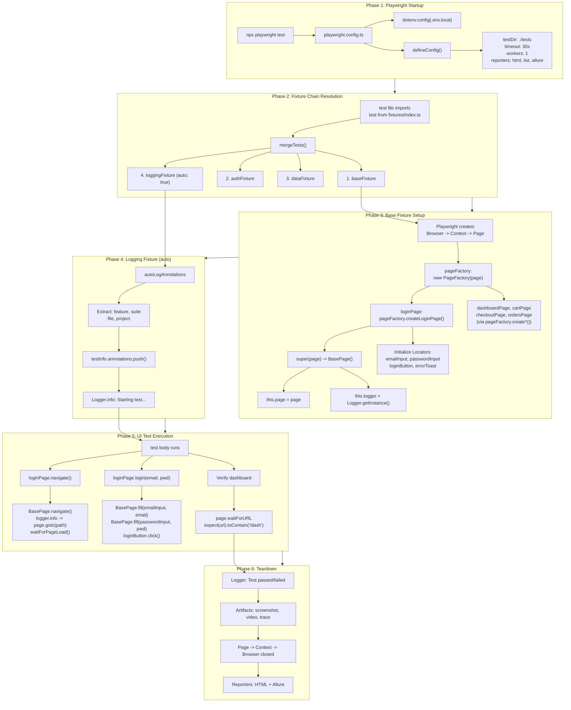

---

## 5. API Test Execution Flow

Traces the full method call chain for an API test with the interceptor pipeline.

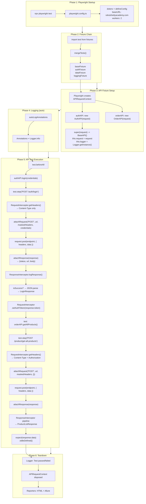

---

## 6. Parallel API Execution

### Architecture Overview

Parallel API tests generate **one token per worker** so that parallel workers never overwrite each other's auth state. Two strategies are supported:

| Strategy | Method | Use Case | Token Storage |
|----------|--------|----------|---------------|
| **Worker-scoped** | `authAPI.login()` with `workerIndex` | Each test authenticates independently | `TokenManager.workerTokens` Map |
| **Shared token** | `authAPI.loginShared()` in `beforeAll` | Login once, all workers share | `TokenManager.sharedToken` |
| **Legacy** | `authAPI.login()` without `workerIndex` | Backward compatible, single-threaded | `RequestInterceptor.token` |

### Parallel Execution Flow

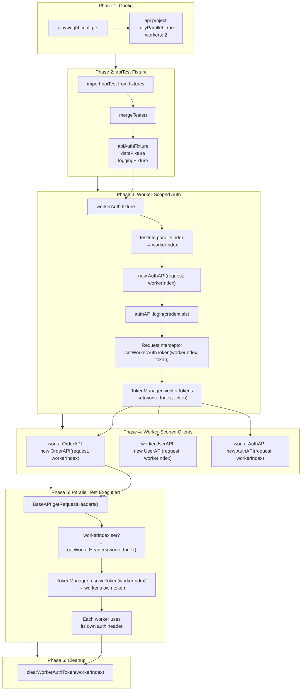

### Worker Token Isolation Diagram

```
┌─────────────────────────────────────────────────┐
│                 TokenManager                     │
│                                                  │
│  workerTokens (Map):                             │
│  ┌──────────┬──────────────────────────┐        │
│  │ Worker 0 │ token: eyJhbGciOi...AAA  │        │
│  ├──────────┼──────────────────────────┤        │
│  │ Worker 1 │ token: eyJhbGciOi...BBB  │        │
│  ├──────────┼──────────────────────────┤        │
│  │ Worker 2 │ token: eyJhbGciOi...CCC  │        │
│  └──────────┴──────────────────────────┘        │
│                                                  │
│  sharedToken: eyJhbGciOi...SHARED (fallback)    │
│                                                  │
│  resolveToken(workerIndex):                      │
│    1. workerTokens.get(workerIndex) → found? ✓  │
│    2. sharedToken → found? ✓                     │
│    3. null → no auth header                      │
└─────────────────────────────────────────────────┘
```

### Usage Patterns

**Pattern 1: Worker-Scoped Tokens (per-test authentication)**
```typescript
import { apiTest as test, expect } from '../../src/fixtures/index';

test.describe('Parallel Tests', () => {
  test.describe.configure({ mode: 'parallel' });

  test('test A', async ({ workerOrderAPI, workerAuth }) => {
    // workerAuth auto-authenticates this worker
    const response = await workerOrderAPI.getAllProducts();
    expect(response.data).toBeDefined();
  });

  test('test B', async ({ workerOrderAPI, workerAuth }) => {
    // Different worker, different token - no conflict
    const response = await workerOrderAPI.getOrdersForCustomer(workerAuth.userId);
    expect(response.data).toBeDefined();
  });
});
```

**Pattern 2: Shared Token (login once in beforeAll)**
```typescript
import { apiTest as test, expect } from '../../src/fixtures/index';
import { AuthAPI } from '../../src/api/clients/AuthAPI';

test.describe('Shared Token Tests', () => {
  test.describe.configure({ mode: 'parallel' });

  test.beforeAll(async ({ request }) => {
    const authAPI = new AuthAPI(request);
    await authAPI.loginShared({ userEmail, userPassword });
    // All workers fall back to this shared token
  });

  test.afterAll(async () => {
    RequestInterceptor.clearSharedAuthToken();
  });
});
```

### E2E Multi-User API Scenario

The `e2e-api.spec.ts` test dynamically generates `N` users (controlled by `NUM_USERS` env var, default 3) that each run a complete lifecycle **serially** within their own `test.describe`, while **different users run in parallel** across Playwright workers.

```mermaid
flowchart TB
    subgraph Control["Control Panel"]
        A["NUM_USERS = process.env.NUM_USERS || 3"]
        A --> B["for (let i = 0; i < NUM_USERS; i++)"]
    end

    subgraph User1["test.describe('E2E User 1/3', { mode: 'serial' })"]
        C1["Step 1: Register"] --> C2["Step 2: Login\n(save token + userId)"]
        C2 --> C3["Step 3: Browse Products\n(setAuthToken)"]
        C3 --> C4["Step 4: Create Order\n(setAuthToken)"]
        C4 --> C5["Step 5: Verify Order\n(setAuthToken)"]
        C5 --> C6["Step 6: Delete Order\n(setAuthToken)"]
    end

    subgraph User2["test.describe('E2E User 2/3', { mode: 'serial' })"]
        D1["Step 1: Register"] --> D2["Step 2: Login\n(save token + userId)"]
        D2 --> D3["Step 3: Browse Products\n(setAuthToken)"]
        D3 --> D4["Step 4: Create Order\n(setAuthToken)"]
        D4 --> D5["Step 5: Verify Order\n(setAuthToken)"]
        D5 --> D6["Step 6: Delete Order\n(setAuthToken)"]
    end

    subgraph User3["test.describe('E2E User 3/3', { mode: 'serial' })"]
        E1["Step 1: Register"] --> E2["Step 2: Login\n(save token + userId)"]
        E2 --> E3["Step 3: Browse Products\n(setAuthToken)"]
        E3 --> E4["Step 4: Create Order\n(setAuthToken)"]
        E4 --> E5["Step 5: Verify Order\n(setAuthToken)"]
        E5 --> E6["Step 6: Delete Order\n(setAuthToken)"]
    end

    B --> User1
    B --> User2
    B --> User3

    style User1 fill:#e3f2fd
    style User2 fill:#f3e5f5
    style User3 fill:#e8f5e9
```

**Key Design Decisions:**
- Uses `@playwright/test` directly (not `apiTest` fixture) since each user registers fresh and manages its own token
- **Shared token pattern**: Login once in Step 2, save `token` + `userId` to shared variables. Steps 3–6 call `RequestInterceptor.setAuthToken(token)` to re-set the saved token (needed because each Playwright test gets a fresh `request` context) — no re-login required
- `shortId = Date.now() % 100000 + i` keeps firstName/lastName under API's 20-char limit
- `test.describe.configure({ mode: 'serial' })` ensures steps run in order per user
- Deterministic titles (`E2E User ${i+1}/${NUM_USERS}`) — required by Playwright for worker process matching

### Allure Request/Response Attachments

`BaseAPI` wraps every HTTP method in `test.step()` and automatically attaches request/response JSON to the Allure report via Playwright's native `test.info().attach()`:

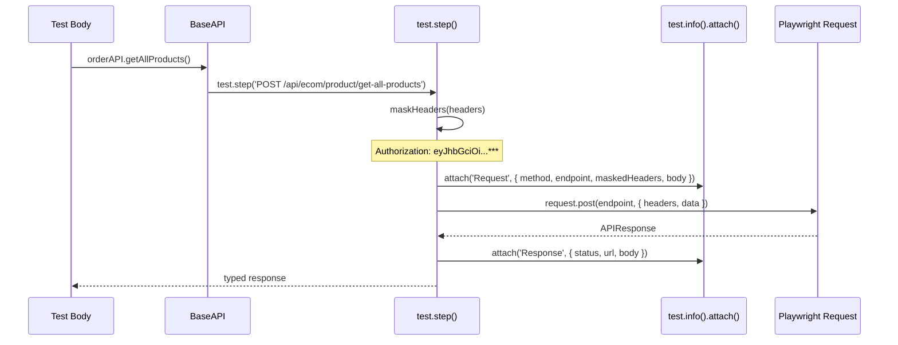

**Result in Allure Report:**
```
test: 'Step 3: Browse and select a product'
  └── POST /api/ecom/auth/login
  │     ├── 📎 Request  (application/json)
  │     └── 📎 Response (application/json)
  └── POST /api/ecom/product/get-all-products
        ├── 📎 Request  (application/json)
        └── 📎 Response (application/json)
```

---

## 7. Fixture Dependency Graph

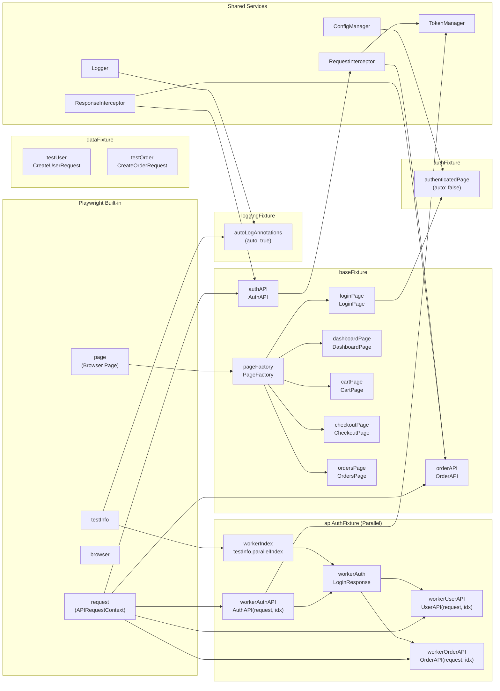

### Fixture Layers

| Order | Fixture | Auto | Provides |
|-------|---------|------|----------|
| 1 | `baseFixture` | No | `pageFactory`, `loginPage`, `dashboardPage`, `cartPage`, `checkoutPage`, `ordersPage`, `authAPI`, `orderAPI` |
| 2 | `authFixture` | No | `authenticatedPage` (pre-logged-in page via UI) |
| 3 | `apiAuthFixture` | No | `workerIndex`, `workerAuth`, `workerAuthAPI`, `workerUserAPI`, `workerOrderAPI` (parallel-safe API clients) |
| 4 | `dataFixture` | No | `testUser`, `testOrder` (generated test data) |
| 5 | `loggingFixture` | **Yes** | Auto-annotations + start/end logging for every test |

### Fixture Composition

| Export | Fixtures Merged | Use Case |
|--------|----------------|----------|
| `test` | baseFixture + authFixture + dataFixture + loggingFixture | UI tests, hybrid tests, sequential API tests |
| `apiTest` | apiAuthFixture + dataFixture + loggingFixture | Parallel API tests with worker-scoped tokens |

---

## 8. Sequence Diagrams

### UI: `loginPage.login()` Call Chain

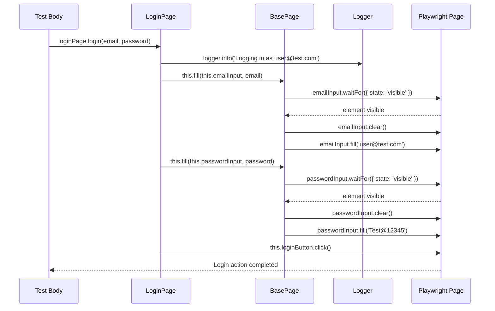

### API: `authAPI.login()` Call Chain (with Interceptors + Allure Attachments)

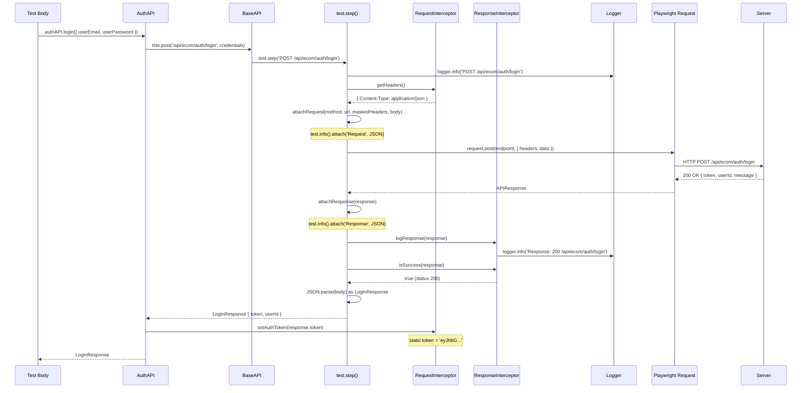

### API: `orderAPI.getAllProducts()` (After Login, with Allure Attachments)

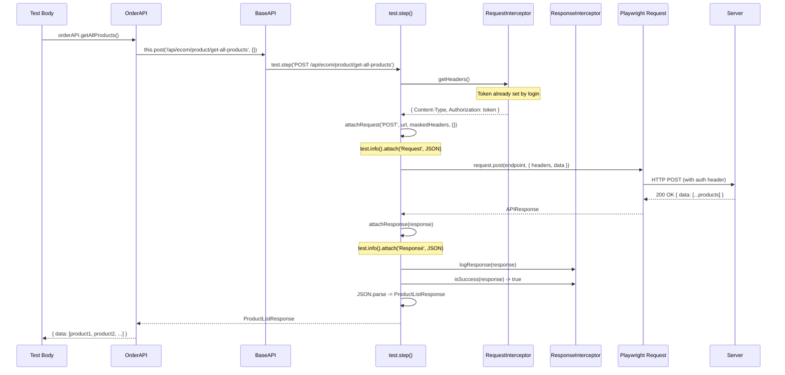

### API: Error Response Flow (4xx/5xx)

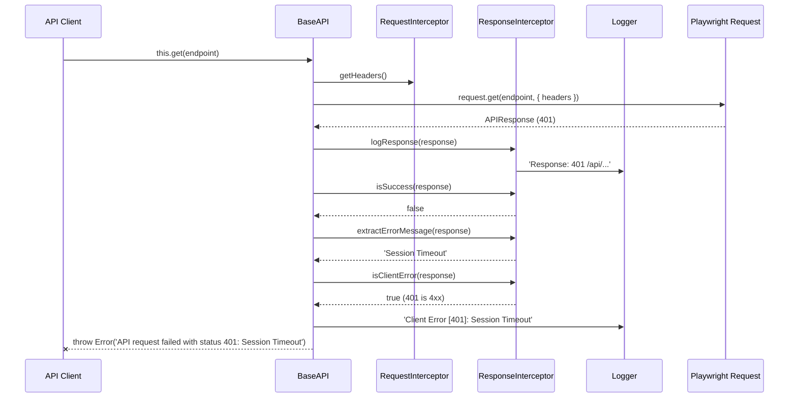

### Parallel API: Worker-Scoped Auth Flow

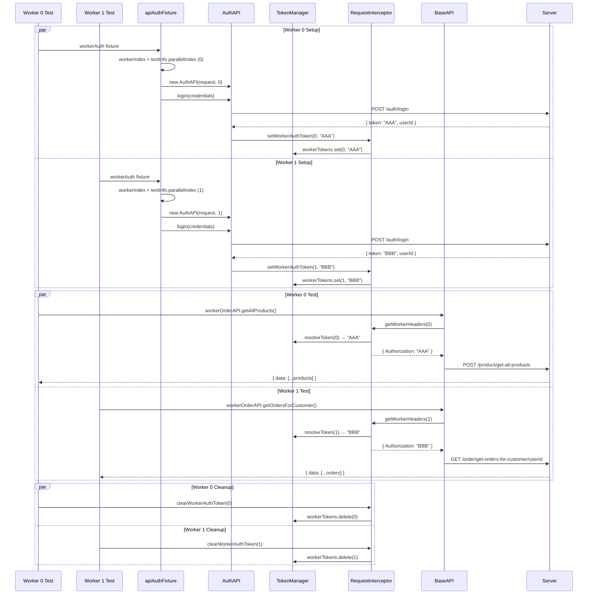

---

## 9. UI vs API Comparison

| Aspect | UI Test | API Test (Legacy) | API Test (Parallel) |
|--------|---------|----------|---------------------|
| **Playwright provides** | `page` (Browser Page) | `request` (APIRequestContext) | `request` (APIRequestContext) |
| **Base class** | `BasePage` (abstract) | `BaseAPI` (abstract) | `BaseAPI` (abstract, workerIndex) |
| **Fixture export** | `test` | `test` | `apiTest` |
| **Constructor stores** | `this.page = page` | `this.request = request` | `this.request + this.workerIndex` |
| **Interaction methods** | `click()`, `fill()`, `getText()` | `get<T>()`, `post<T>()`, `delete<T>()` | Same + worker-aware headers |
| **Auth mechanism** | Browser cookies/session | `RequestInterceptor` (static token) | `TokenManager` (per-worker Map) |
| **Request headers** | Managed by browser | `getHeaders()` | `getWorkerHeaders(workerIndex)` |
| **Token storage** | Browser session | `RequestInterceptor.token` | `TokenManager.workerTokens` |
| **Parallel safe?** | Yes (isolated contexts) | No (shared static token) | Yes (worker-scoped tokens) |
| **Response handling** | DOM assertions | `ResponseInterceptor` pipeline | Same |
| **Waits for** | DOM elements | HTTP responses | Same |
| **Returns** | Strings, booleans | Typed JSON objects | Same |
| **Artifacts on failure** | Screenshots, video, trace | Request/Response JSON attachments + logs | Request/Response JSON attachments + logs |
| **Browser needed?** | Yes | No | No |
| **Speed** | Slower (rendering) | Faster (HTTP only) | Fastest (parallel HTTP) |

---

## 10. Detailed Phase Breakdown

### Phase 1: Playwright Startup

When `npx playwright test` runs, Playwright reads `playwright.config.ts`:

```
playwright.config.ts
  |-- dotenv.config('.env.local')  // Load environment variables
  |-- defineConfig({
  |     testDir: './tests',
  |     timeout: 30000,
  |     workers: 2,                  // 2 parallel workers
  |     retries: CI ? 2 : 0,
  |     reporters: ['html', 'list', 'allure-playwright'],
  |     projects: [
  |       { name: 'api',             // API-only project
  |         testDir: './tests/api',
  |         fullyParallel: true,     // All API tests run in parallel
  |         use: { baseURL: 'https://rahulshettyacademy.com' }
  |       },
  |       { name: 'chromium', ... }, // UI projects
  |     ],
  |     use: {
  |       baseURL: 'https://rahulshettyacademy.com/client/',
  |       screenshot: 'only-on-failure',
  |       video: 'retain-on-failure',
  |       trace: 'on-first-retry'
  |     }
  |   })
```

### Phase 2: Fixture Resolution

Test files import either `test` or `apiTest` from `src/fixtures/index.ts`:

```typescript
// Legacy (UI + sequential API)
export const test = mergeTests(baseFixture, authFixture, dataFixture, loggingFixture);

// Parallel API
export const apiTest = mergeTests(apiAuthFixture, dataFixture, loggingFixture);
```

Playwright resolves which fixtures the test needs based on destructured parameters.

### Phase 3: Fixture Setup

**UI fixtures** create page objects via PageFactory:
```
new PageFactory(page)
  -> pageFactory.createLoginPage()
      -> new LoginPage(page)
          -> super(page) -> BasePage()
              -> this.page = page
              -> this.logger = Logger.getInstance()
          -> Initialize locators (lazy - no DOM queries yet)
  -> pageFactory.createDashboardPage(), etc.
```

**API fixtures (legacy)** create API clients:
```
new AuthAPI(request)
  -> super(request) -> BaseAPI(request)
      -> this.request = request
      -> this.logger = Logger.getInstance()
new OrderAPI(request)
  -> super(request) -> BaseAPI(request)
      -> this.request = request
      -> this.logger = Logger.getInstance()
```

**API fixtures (parallel)** create worker-scoped API clients:
```
workerIndex = testInfo.parallelIndex  // e.g. 0, 1, 2...
new AuthAPI(request, workerIndex)
  -> super(request, workerIndex) -> BaseAPI(request, 0)
      -> this.request = request
      -> this.workerIndex = 0
      -> this.logger = Logger.getInstance()
authAPI.login(credentials)
  -> RequestInterceptor.setWorkerAuthToken(0, token)
  -> TokenManager.workerTokens.set(0, token)
```

### Phase 4: Logging (Auto)

Runs for every test automatically:
```
1. Extract feature name from test.describe() title
2. Determine suite type (ui/api/hybrid) from file path
3. Push annotations to testInfo
4. Log: "Starting test: 'should get all products' [order-api.spec.ts]"
```

### Phase 5: Test Execution

**UI path**: Test -> Page Object -> BasePage protected methods -> Playwright Page API
**API path**: Test -> API Client -> BaseAPI protected methods -> `test.step()` wrapping -> `attachRequest()` -> Interceptors -> Playwright Request API -> `attachResponse()` -> ResponseInterceptor

Every API call produces a nested Allure step with Request and Response JSON attachments. Authorization headers are masked (`eyJhbGci...***`) in attachments for security.

### Phase 6: Teardown

```
1. Logging fixture: "Test passed (1234ms)" or "Test failed (5678ms)"
2. Playwright captures artifacts (screenshot, video, trace) based on config
3. Resources cleaned up: Page -> Context -> Browser (UI) or APIRequestContext (API)
4. Reporters generate output: HTML + Allure + console
```

### Singleton Initialization

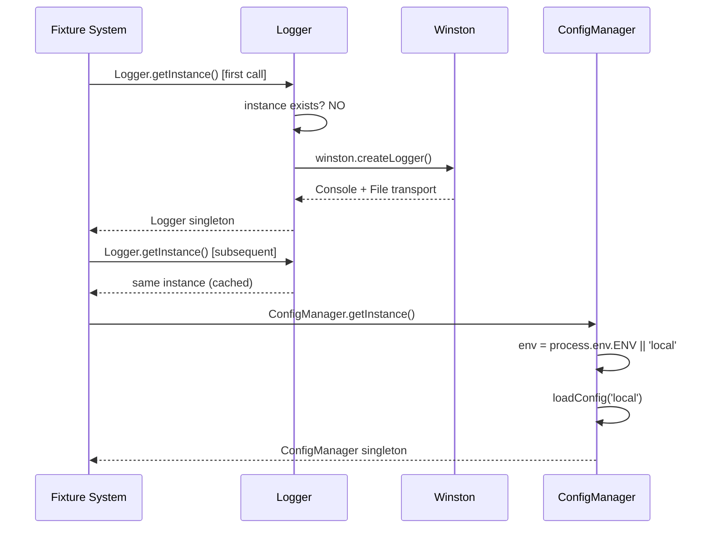

---

## Folder Structure Reference

```
playwright-framework/
  playwright.config.ts           # Global config + environment loading + parallel API project
  src/
    fixtures/
      index.ts                   # test = mergeTests(base,auth,data,log) + apiTest = mergeTests(apiAuth,data,log)
      base.fixture.ts            # PageFactory + page objects + API clients
      auth.fixture.ts            # Pre-authenticated page
      api-auth.fixture.ts        # Parallel-safe: workerIndex, workerAuth, workerAuthAPI, workerUserAPI, workerOrderAPI
      data.fixture.ts            # Test data (testUser, testOrder)
      logging.fixture.ts         # Auto-annotations + logging
    pages/
      LoginPage.ts               # Login form interactions
      DashboardPage.ts           # Product listing + cart
      CartPage.ts                # Cart review + checkout
      CheckoutPage.ts            # Country selection + place order
      UserProfilePage.ts         # Orders page
      locators/                  # Centralized locator definitions
    api/
      clients/
        AuthAPI.ts               # login(workerIndex?), loginShared(), register()
        UserAPI.ts               # registerUser(), getUserDetails() [workerIndex-aware]
        OrderAPI.ts              # getAllProducts(), createOrder(), etc. [workerIndex-aware]
      interceptors/
        RequestInterceptor.ts    # getHeaders(), getWorkerHeaders(), setWorkerAuthToken(), setSharedAuthToken()
        ResponseInterceptor.ts   # Response logging + error classification
        TokenManager.ts          # Worker-scoped token Map + shared token + resolveToken()
      models/
        AuthModels.ts            # LoginRequest/Response, RegisterRequest/Response
        UserModels.ts            # CreateUserRequest, UserResponse
        OrderModels.ts           # Product, Order, CreateOrderRequest/Response
    core/
      base/
        BaseAPI.ts               # Abstract: HTTP methods + workerIndex + getRequestHeaders() + Allure attachments
        BasePage.ts              # Abstract: page interactions
      logger/
        Logger.ts                # Winston singleton (console + file)
      config/
        ConfigManager.ts         # Environment-specific config singleton
        EnvironmentConfig.ts     # Environment configuration interface
        environments/            # Per-environment config files
      strategies/
        IExecutionStrategy.ts    # Strategy interface
        LocalStrategy.ts         # Local execution strategy
        StagingStrategy.ts       # Staging execution strategy
        CIStrategy.ts            # CI execution strategy
    utils/
      helpers/                   # DateHelper, StringHelper, WaitHelper, TestAnnotation
      types/
        global.d.ts              # Global type declarations
    data/
      test-data.ts               # Static test data (credentials, products)
      test-data.json             # JSON test data
      builders/                  # UserBuilder, OrderBuilder, AddressBuilder
      factories/                 # TestDataFactory, PageFactory
  tests/
    ui/                          # UI-only tests (login, dashboard)
    api/                         # API-only tests (auth, user, order)
      parallel-api.spec.ts       # Worker-scoped parallel token tests
      shared-token-api.spec.ts   # Shared token parallel tests
      e2e-api.spec.ts            # Multi-user E2E: Register→Login→Order→Verify→Delete (NUM_USERS)
    hybrid/                      # E2E combining UI + API
```
