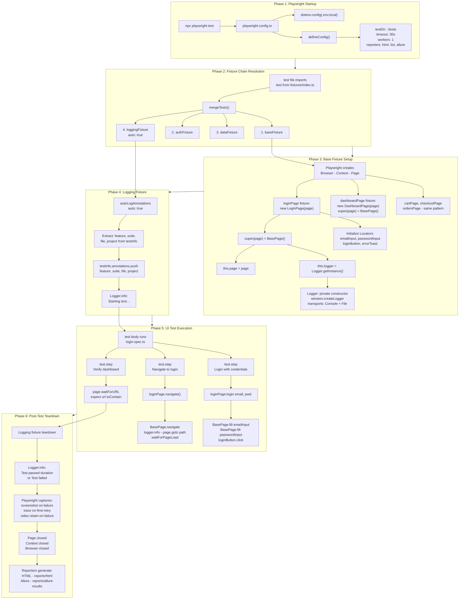
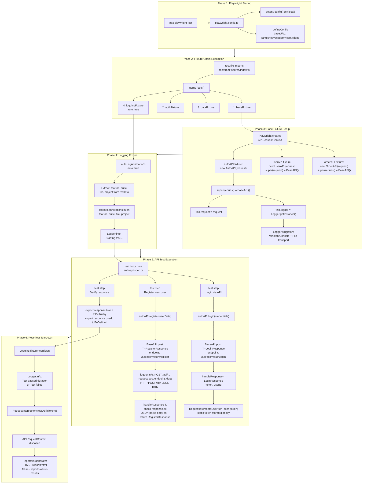
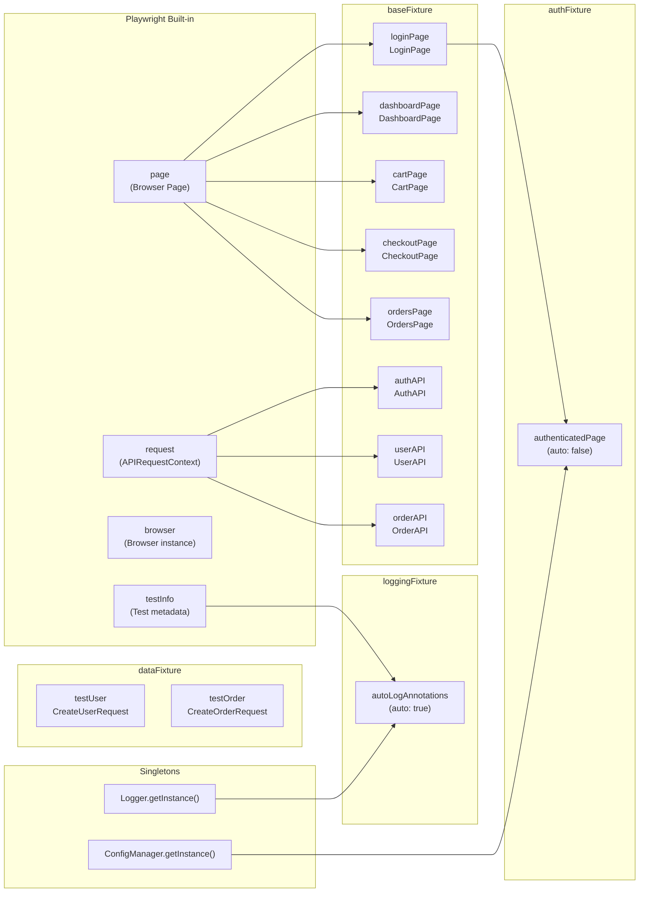
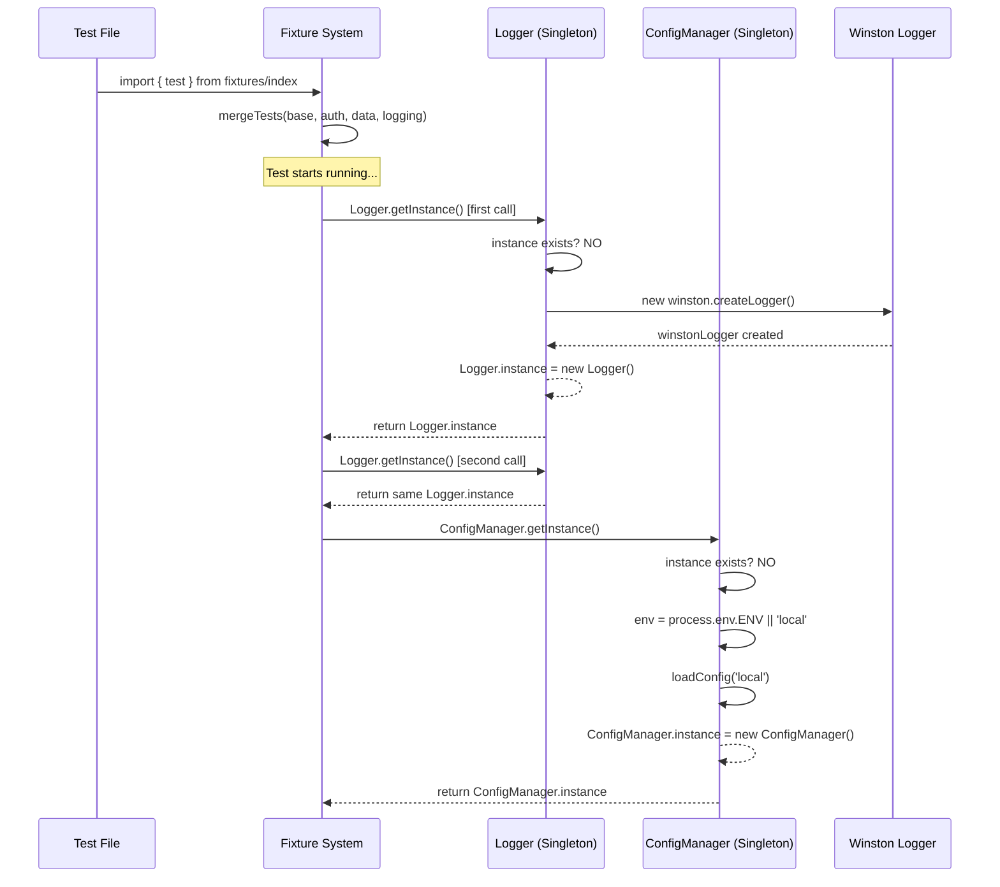
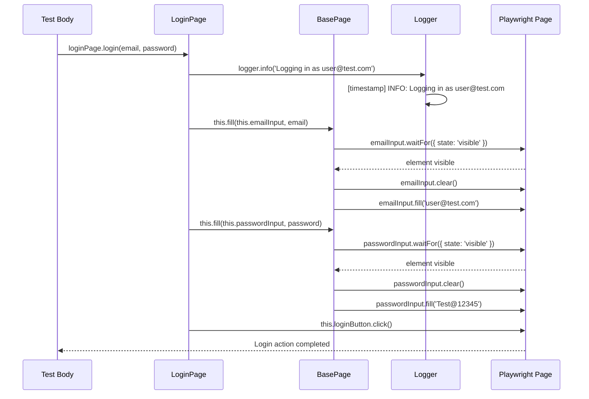
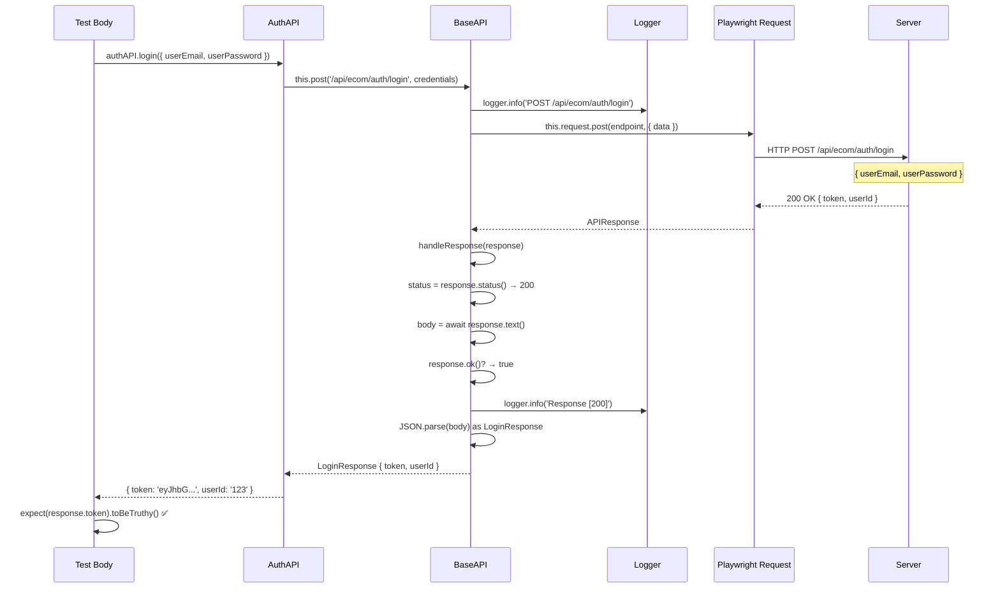

# Playwright POM Framework — Architecture & Execution Flow

---

## Table of Contents

1. [Class Hierarchy Diagram](#1-class-hierarchy-diagram)
2. [UI Test Execution Flow](#2-ui-test-execution-flow)
3. [API Test Execution Flow](#3-api-test-execution-flow)
4. [UI vs API Comparison](#4-ui-vs-api-comparison)
5. [Detailed Phase Breakdown](#5-detailed-phase-breakdown)

---

## 1. Class Hierarchy Diagram

This diagram shows the inheritance chains, method signatures, and relationships between all classes in the framework.

```mermaid
classDiagram
    direction TB

    class BasePage {
        <<abstract>>
        #page: Page
        #logger: Logger
        +abstract path: string
        +navigate() Promise~void~
        +waitForPageLoad() Promise~void~
        +getTitle() Promise~string~
        +getCurrentUrl() Promise~string~
        +takeScreenshot(name) Promise~Buffer~
        #click(locator) Promise~void~
        #fill(locator, value) Promise~void~
        #getText(locator) Promise~string~
        #isVisible(locator) Promise~boolean~
        #selectOption(locator, value) Promise~void~
        #uploadFile(locator, path) Promise~void~
    }

    class LoginPage {
        +path = '#/auth/login'
        -emailInput: Locator
        -passwordInput: Locator
        -loginButton: Locator
        -errorToast: Locator
        +login(email, password) Promise~void~
        +getErrorMessage() Promise~string~
        +isLoginButtonVisible() Promise~boolean~
        +clickRegister() Promise~void~
    }

    class DashboardPage {
        +path = '#/dashboard/dash'
        -products: Locator
        -cartLink: Locator
        +addProductToCart(name) Promise~void~
        +goToCart() Promise~void~
        +getProductNames() Promise~string[]~
    }

    class CartPage {
        +path = '#/dashboard/cart'
        -cartItems: Locator
        -checkoutBtn: Locator
        +isProductInCart(name) Promise~boolean~
        +checkout() Promise~void~
    }

    class CheckoutPage {
        +path = '#/dashboard/order'
        -countryInput: Locator
        -placeOrderBtn: Locator
        +selectCountry(prefix) Promise~void~
        +placeOrder() Promise~void~
        +getConfirmationMessage() Promise~string~
    }

    class BaseAPI {
        <<abstract>>
        #request: APIRequestContext
        #logger: Logger
        #get~T~(endpoint, params?) Promise~T~
        #post~T~(endpoint, data?) Promise~T~
        #put~T~(endpoint, data?) Promise~T~
        #patch~T~(endpoint, data?) Promise~T~
        #delete~T~(endpoint) Promise~T~
        #getRaw(endpoint, params?) Promise~APIResponse~
        -handleResponse~T~(response) Promise~T~
    }

    class AuthAPI {
        +login(credentials) Promise~LoginResponse~
        +register(data) Promise~RegisterResponse~
    }

    class UserAPI {
        +registerUser(data) Promise~RegisterResponse~
        +getUserDetails(userId, token) Promise~UserResponse~
    }

    class OrderAPI {
        -token: string
        +setToken(token) void
        +getAllProducts(token) Promise~ProductListResponse~
        +createOrder(data, token) Promise~CreateOrderResponse~
        +getOrdersForCustomer(userId, token) Promise~OrderListResponse~
        +deleteOrder(orderId, token) Promise~DeleteResponse~
    }

    class BaseComponent {
        <<abstract>>
        #page: Page
        #root: Locator
        +isVisible() Promise~boolean~
        +waitForVisible() Promise~void~
        +waitForHidden() Promise~void~
    }

    class DataTable {
        -rows: Locator
        -headers: Locator
        +getRowCount() Promise~number~
        +getHeaderTexts() Promise~string[]~
        +getCellText(row, col) Promise~string~
        +clickRow(index) Promise~void~
        +getRowTexts() Promise~string[]~
    }

    class Logger {
        <<singleton>>
        -static instance: Logger
        -winstonLogger: winston.Logger
        +static getInstance() Logger
        +info(message) void
        +warn(message) void
        +error(message) void
        +debug(message) void
    }

    class ConfigManager {
        <<singleton>>
        -static instance: ConfigManager
        -config: EnvironmentConfig
        +static getInstance() ConfigManager
        +getConfig() EnvironmentConfig
        +get~K~(key) EnvironmentConfig[K]
    }

    class RequestInterceptor {
        <<static>>
        -static token: string
        +static setAuthToken(token) void
        +static clearAuthToken() void
        +static getHeaders() Record
    }

    BasePage <|-- LoginPage
    BasePage <|-- DashboardPage
    BasePage <|-- CartPage
    BasePage <|-- CheckoutPage
    BaseAPI <|-- AuthAPI
    BaseAPI <|-- UserAPI
    BaseAPI <|-- OrderAPI
    BaseComponent <|-- DataTable

    BasePage ..> Logger : uses
    BaseAPI ..> Logger : uses
    LoginPage ..> RequestInterceptor : uses
    AuthAPI ..> RequestInterceptor : uses
```



### Class Hierarchy Explanation

**Three inheritance chains exist in this framework:**

| Base Class | Pattern | Subclasses | Purpose |
|------------|---------|------------|---------|
| `BasePage` (abstract) | Page Object Model | `LoginPage`, `DashboardPage`, `CartPage`, `CheckoutPage` | Browser UI interactions |
| `BaseAPI` (abstract) | API Client | `AuthAPI`, `UserAPI`, `OrderAPI` | REST API calls |
| `BaseComponent` (abstract) | Component | `DataTable` | Reusable UI components |

**Two singletons provide shared services:**

| Singleton | Purpose | Access |
|-----------|---------|--------|
| `Logger` | Winston logging to console + file | `Logger.getInstance()` |
| `ConfigManager` | Environment-specific configuration | `ConfigManager.getInstance()` |

**Key Design Decisions:**
- `#` (protected) methods in `BasePage` like `click()`, `fill()`, `getText()` — only subclasses can use them
- `-` (private) fields like `emailInput` in `LoginPage` — encapsulated, not exposed
- `+` (public) methods like `login()` — the test-facing API
- `BaseAPI` uses generics (`<T>`) so each endpoint returns its own typed response

---

## 2. UI Test Execution Flow

This diagram traces every method call from running `npx playwright test` through to test completion for a **UI test** (e.g., `login.spec.ts`).



### UI Flow — Phase-by-Phase Explanation

#### Phase 1: Playwright Startup
When you run `npx playwright test`, Playwright reads `playwright.config.ts` first:
- **dotenv** loads environment variables from `.env.local` (or `.env.staging` / `.env.production`)
- **defineConfig()** sets global options: test directory, timeouts, workers, reporters
- The config tells Playwright to look for test files in `./tests/` folder

#### Phase 2: Fixture Chain Resolution
Each test file imports `test` from `src/fixtures/index.ts`, which merges **4 fixture layers**:

```
mergeTests(baseFixture, authFixture, dataFixture, loggingFixture)
```

| Order | Fixture | Auto? | Provides |
|-------|---------|-------|----------|
| 1st | `baseFixture` | No | `loginPage`, `dashboardPage`, `cartPage`, `checkoutPage`, `ordersPage`, `authAPI`, `userAPI`, `orderAPI` |
| 2nd | `authFixture` | No | `authenticatedPage` (login flow) |
| 3rd | `dataFixture` | No | `testUser`, `testOrder` (generated test data) |
| 4th | `loggingFixture` | **Yes** | Auto-annotations + start/end logging |

#### Phase 3: Base Fixture Setup
For each fixture the test requests (e.g., `loginPage`), this chain executes:

```
new LoginPage(page)
  └─ super(page) → BasePage constructor
       ├─ this.page = page                    // Store Playwright Page reference
       └─ this.logger = Logger.getInstance()  // Get or create singleton Logger
            └─ First call only: new Logger()
                 └─ winston.createLogger({
                      transports: [Console, File('reports/test-execution.log')]
                    })
  └─ this.emailInput = page.locator('#userEmail')     // Lazy locator
  └─ this.passwordInput = page.locator('#userPassword')
  └─ this.loginButton = page.locator('#login')
```

> **Note:** Locators are lazy — no DOM queries happen until you interact with them.

#### Phase 4: Logging Fixture (Auto)
Because `loggingFixture` has `{ auto: true }`, it runs for **every test** automatically:

```
1. Extract feature name from test.describe() title
2. Extract suite (ui/api/hybrid) from file path
3. Push 4 annotations to testInfo: feature, suite, file, project
4. Log: "▶ Starting test: 'should login with valid credentials' [login.spec.ts]"
```

#### Phase 5: UI Test Execution
The test body runs with access to all requested fixtures:

```typescript
test('should login with valid credentials', async ({ loginPage, page }) => {

  // Step 1: Navigate
  await loginPage.navigate();
  //   └─ BasePage.navigate()
  //       ├─ logger.info('Navigating to #/auth/login')
  //       ├─ page.goto('#/auth/login')         ← Playwright drives browser
  //       └─ page.waitForLoadState('domcontentloaded')

  // Step 2: Login
  await loginPage.login(email, password);
  //   └─ LoginPage.login()
  //       ├─ BasePage.fill(emailInput, email)  ← waitFor + clear + fill
  //       ├─ BasePage.fill(passwordInput, pwd) ← waitFor + clear + fill
  //       └─ loginButton.click()               ← Playwright clicks

  // Step 3: Verify
  await page.waitForURL('**/dash');
  expect(page.url()).toContain('/dashboard/dash');
});
```

#### Phase 6: Post-Test Teardown
After the test body completes (pass or fail):

```
1. Logging fixture logs: "✅ Test passed (1234ms)" or "❌ Test failed (5678ms)"
2. Playwright captures artifacts based on config:
   - screenshot: only-on-failure (full page)
   - trace: on-first-retry only
   - video: retain-on-failure (recorded always, kept only on failure)
3. Page → Context → Browser are closed
4. Reporters generate output:
   - HTML report → reports/html/
   - Allure report → reports/allure-results/
   - List reporter → console output
```

---

## 3. API Test Execution Flow

This diagram traces every method call for an **API test** (e.g., `auth-api.spec.ts`).



### API Flow — Phase-by-Phase Explanation

#### Phase 1–2: Same as UI
Config loading and fixture resolution are identical. The difference begins in Phase 3.

#### Phase 3: Base Fixture Setup (API)
Instead of a browser `Page`, Playwright provides an `APIRequestContext`:

```
new AuthAPI(request)
  └─ super(request) → BaseAPI constructor
       ├─ this.request = request              // Store Playwright APIRequestContext
       └─ this.logger = Logger.getInstance()  // Get or create singleton Logger
```

> **Key difference:** No browser is launched. `APIRequestContext` sends raw HTTP requests.

#### Phase 5: API Test Execution
The test calls API client methods that delegate to `BaseAPI`:

```typescript
test('should login via API', async ({ authAPI }) => {

  // Step 1: Register
  const registerResponse = await authAPI.register(userData);
  //   └─ AuthAPI.register(data)
  //       └─ BaseAPI.post<RegisterResponse>('/api/ecom/auth/register', data)
  //           ├─ logger.info('POST /api/ecom/auth/register')
  //           ├─ this.request.post(endpoint, { data })  ← HTTP POST
  //           └─ handleResponse<RegisterResponse>(response)
  //               ├─ status = response.status()          // e.g., 200
  //               ├─ body = await response.text()        // raw JSON string
  //               ├─ if (!response.ok()) → throw Error
  //               └─ return JSON.parse(body) as RegisterResponse

  // Step 2: Login
  const loginResponse = await authAPI.login({ userEmail, userPassword });
  //   └─ AuthAPI.login(credentials)
  //       └─ BaseAPI.post<LoginResponse>('/api/ecom/auth/login', credentials)
  //           └─ handleResponse → { token: 'eyJhbG...', userId: '123' }

  // Step 3: Store token for subsequent requests
  RequestInterceptor.setAuthToken(loginResponse.token);
  //   └─ static token = 'eyJhbG...'
  //   └─ Next getHeaders() call will include: Authorization: Bearer eyJhbG...

  // Step 4: Verify
  expect(loginResponse.token).toBeTruthy();
  expect(loginResponse.userId).toBeDefined();
});
```

#### The `handleResponse<T>()` Method — Core of API Flow

This private method in `BaseAPI` handles every API response:

```
handleResponse<T>(response: APIResponse)
  │
  ├─ status = response.status()     // 200, 201, 400, 500, etc.
  ├─ body = await response.text()   // Raw JSON string
  │
  ├─ if (!response.ok())            // status >= 400
  │    ├─ logger.error(`API Error [${status}]: ${body}`)
  │    └─ throw new Error(`API request failed with status ${status}: ${body}`)
  │
  └─ if (response.ok())             // status 200-399
       ├─ logger.info(`Response [${status}]`)
       └─ return JSON.parse(body) as T   // Parse and return typed object
```

---

## 4. UI vs API Comparison

| Aspect | UI Test | API Test |
|--------|---------|----------|
| **Playwright provides** | `page` (browser Page) | `request` (APIRequestContext) |
| **Base class** | `BasePage` (abstract) | `BaseAPI` (abstract) |
| **Constructor stores** | `this.page = page` | `this.request = request` |
| **Interaction methods** | `click()`, `fill()`, `getText()`, `isVisible()` | `get<T>()`, `post<T>()`, `put<T>()`, `delete<T>()` |
| **Waits for** | DOM elements (`waitFor`, `waitForLoadState`) | HTTP responses (`handleResponse`) |
| **Returns** | DOM content (strings, booleans) | Typed JSON objects (`LoginResponse`, etc.) |
| **Assertions** | `expect(locator).toBeVisible()` | `expect(response.token).toBeTruthy()` |
| **Auth mechanism** | Browser cookies/session | `RequestInterceptor` (static token) |
| **Artifacts on failure** | Screenshots, video, trace | None (only logs) |
| **Browser needed?** | Yes | No |
| **Speed** | Slower (browser rendering) | Faster (HTTP only) |

---

## 5. Detailed Phase Breakdown

### Fixture Dependency Graph



### Singleton Initialization Timeline



### Method Call Chain: `loginPage.login()`



### Method Call Chain: `authAPI.login()`



---

## Summary

The framework follows a **layered architecture**:

```
┌─────────────────────────────────────────────────┐
│                  TEST LAYER                      │
│   login.spec.ts  │  auth-api.spec.ts  │  e2e    │
├─────────────────────────────────────────────────┤
│                FIXTURE LAYER                     │
│   base  →  auth  →  data  →  logging            │
├────────────────────┬────────────────────────────┤
│    PAGE OBJECTS     │      API CLIENTS           │
│  LoginPage         │  AuthAPI                    │
│  DashboardPage     │  UserAPI                    │
│  CartPage          │  OrderAPI                   │
│  CheckoutPage      │                             │
├────────────────────┼────────────────────────────┤
│    BasePage        │      BaseAPI                │
│  (abstract)        │  (abstract)                 │
├────────────────────┴────────────────────────────┤
│              SHARED SERVICES                     │
│  Logger (Singleton)  │  ConfigManager (Singleton)│
│  RequestInterceptor  │  WaitHelper               │
├─────────────────────────────────────────────────┤
│              PLAYWRIGHT ENGINE                   │
│  Page  │  APIRequestContext  │  Browser           │
└─────────────────────────────────────────────────┘
```

Each layer only depends on the layer below it, ensuring clean separation of concerns and maintainability.
