# Playwright POM Framework - Architecture & Execution Flow

---

## Table of Contents

1. [High-Level Architecture](#1-high-level-architecture)
2. [Class Hierarchy Diagram](#2-class-hierarchy-diagram)
3. [Interceptor Pipeline](#3-interceptor-pipeline)
4. [UI Test Execution Flow](#4-ui-test-execution-flow)
5. [API Test Execution Flow](#5-api-test-execution-flow)
6. [Fixture Dependency Graph](#6-fixture-dependency-graph)
7. [Sequence Diagrams](#7-sequence-diagrams)
8. [UI vs API Comparison](#8-ui-vs-api-comparison)
9. [Detailed Phase Breakdown](#9-detailed-phase-breakdown)

---

## 1. High-Level Architecture

```
+---------------------------------------------------+
|                   TEST LAYER                       |
|  login.spec.ts | auth-api.spec.ts | e2e.spec.ts   |
+---------------------------------------------------+
|                 FIXTURE LAYER                      |
|  base  ->  auth  ->  data  ->  logging (auto)     |
+------------------------+--------------------------+
|     PAGE OBJECTS       |      API CLIENTS          |
|  LoginPage             |  AuthAPI                  |
|  DashboardPage         |  UserAPI                  |
|  CartPage              |  OrderAPI                 |
|  CheckoutPage          |                           |
|  OrdersPage            |                           |
+------------------------+--------------------------+
|     BasePage           |      BaseAPI              |
|  (abstract)            |  (abstract)               |
|                        |  + RequestInterceptor     |
|                        |  + ResponseInterceptor    |
+------------------------+--------------------------+
|              SHARED SERVICES                       |
|  Logger (Singleton)  |  ConfigManager (Singleton)  |
|  WaitHelper          |  TestAnnotation             |
+---------------------------------------------------+
|              PLAYWRIGHT ENGINE                     |
|  Page | APIRequestContext | Browser | BrowserContext|
+---------------------------------------------------+
```

Each layer depends only on the layer below it. Tests never call Playwright APIs directly - they go through Page Objects or API Clients.

---

## 2. Class Hierarchy Diagram

```mermaid
classDiagram
    direction TB

    class BasePage {
        <<abstract>>
        #page: Page
        #logger: Logger
        +abstract path: string
        +navigate() Promise~void~
        +waitForPageLoad() Promise~void~
        +getTitle() Promise~string~
        +getCurrentUrl() Promise~string~
        +takeScreenshot(name) Promise~Buffer~
        #click(locator) Promise~void~
        #fill(locator, value) Promise~void~
        #getText(locator) Promise~string~
        #isVisible(locator) Promise~boolean~
        #selectOption(locator, value) Promise~void~
        #uploadFile(locator, path) Promise~void~
    }

    class LoginPage {
        +path: string
        -emailInput: Locator
        -passwordInput: Locator
        -loginButton: Locator
        -errorToast: Locator
        +login(email, password) Promise~void~
        +getErrorMessage() Promise~string~
        +isLoginButtonVisible() Promise~boolean~
        +clickRegister() Promise~void~
    }

    class DashboardPage {
        +path: string
        -productCards: Locator
        -cartButton: Locator
        -searchInput: Locator
        +addProductToCart(name) Promise~void~
        +goToCart() Promise~void~
        +getProductNames() Promise~string[]~
        +getCartCount() Promise~number~
        +signOut() Promise~void~
    }

    class CartPage {
        +path: string
        -cartItems: Locator
        -checkoutBtn: Locator
        +isProductInCart(name) Promise~boolean~
        +checkout() Promise~void~
    }

    class CheckoutPage {
        +path: string
        -countryInput: Locator
        -placeOrderBtn: Locator
        +selectCountry(prefix) Promise~void~
        +placeOrder() Promise~void~
        +getConfirmationMessage() Promise~string~
    }

    class OrdersPage {
        +path: string
        +navigate() Promise~void~
    }

    class BaseAPI {
        <<abstract>>
        #request: APIRequestContext
        #logger: Logger
        #get~T~(endpoint, params?) Promise~T~
        #post~T~(endpoint, data?) Promise~T~
        #put~T~(endpoint, data?) Promise~T~
        #patch~T~(endpoint, data?) Promise~T~
        #delete~T~(endpoint) Promise~T~
        #getRaw(endpoint, params?) Promise~APIResponse~
        -handleResponse~T~(response) Promise~T~
    }

    class AuthAPI {
        +login(credentials) Promise~LoginResponse~
        +register(data) Promise~RegisterResponse~
    }

    class UserAPI {
        +registerUser(data) Promise~RegisterResponse~
        +getUserDetails(userId) Promise~UserResponse~
    }

    class OrderAPI {
        +getAllProducts() Promise~ProductListResponse~
        +createOrder(data) Promise~CreateOrderResponse~
        +getOrdersForCustomer(userId) Promise~OrderListResponse~
        +deleteOrder(orderId) Promise~object~
    }

    class RequestInterceptor {
        <<static>>
        -static token: string | null
        -static logger: Logger
        +static setAuthToken(token) void
        +static clearAuthToken() void
        +static getHeaders() Record~string, string~
    }

    class ResponseInterceptor {
        <<static>>
        -static logger: Logger
        +static logResponse(response) Promise~void~
        +static isSuccess(response) boolean
        +static isClientError(response) boolean
        +static isServerError(response) boolean
        +static extractErrorMessage(response) Promise~string~
    }

    class BaseComponent {
        <<abstract>>
        #page: Page
        #root: Locator
        +isVisible() Promise~boolean~
        +waitForVisible() Promise~void~
        +waitForHidden() Promise~void~
    }

    class DataTable {
        -rows: Locator
        -headers: Locator
        +getRowCount() Promise~number~
        +getHeaderTexts() Promise~string[]~
        +getCellText(row, col) Promise~string~
        +clickRow(index) Promise~void~
    }

    class Logger {
        <<singleton>>
        -static instance: Logger
        -winstonLogger: winston.Logger
        +static getInstance() Logger
        +info(message) void
        +warn(message) void
        +error(message) void
        +debug(message) void
    }

    class ConfigManager {
        <<singleton>>
        -static instance: ConfigManager
        -config: EnvironmentConfig
        +static getInstance() ConfigManager
        +getConfig() EnvironmentConfig
        +get~K~(key) EnvironmentConfig[K]
    }

    BasePage <|-- LoginPage
    BasePage <|-- DashboardPage
    BasePage <|-- CartPage
    BasePage <|-- CheckoutPage
    BasePage <|-- OrdersPage
    BaseAPI <|-- AuthAPI
    BaseAPI <|-- UserAPI
    BaseAPI <|-- OrderAPI
    BaseComponent <|-- DataTable

    BaseAPI ..> RequestInterceptor : getHeaders()
    BaseAPI ..> ResponseInterceptor : handleResponse()
    AuthAPI ..> RequestInterceptor : setAuthToken()
    BasePage ..> Logger : uses
    BaseAPI ..> Logger : uses
```

### Inheritance Summary

| Base Class | Pattern | Subclasses | Purpose |
|------------|---------|------------|---------|
| `BasePage` (abstract) | Page Object Model | `LoginPage`, `DashboardPage`, `CartPage`, `CheckoutPage`, `OrdersPage` | Browser UI interactions |
| `BaseAPI` (abstract) | API Client + Interceptors | `AuthAPI`, `UserAPI`, `OrderAPI` | REST API calls with auto headers |
| `BaseComponent` (abstract) | Component | `DataTable` | Reusable UI components |

### Singletons

| Singleton | Purpose | Access |
|-----------|---------|--------|
| `Logger` | Winston logging to console + file | `Logger.getInstance()` |
| `ConfigManager` | Environment-specific configuration | `ConfigManager.getInstance()` |

---

## 3. Interceptor Pipeline

The interceptor pattern centralizes request headers and response processing. `BaseAPI` uses both interceptors automatically - API clients never handle headers or response parsing directly.

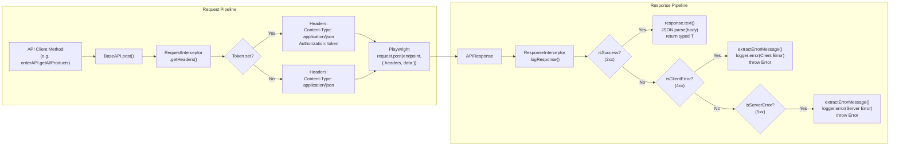

### Token Lifecycle

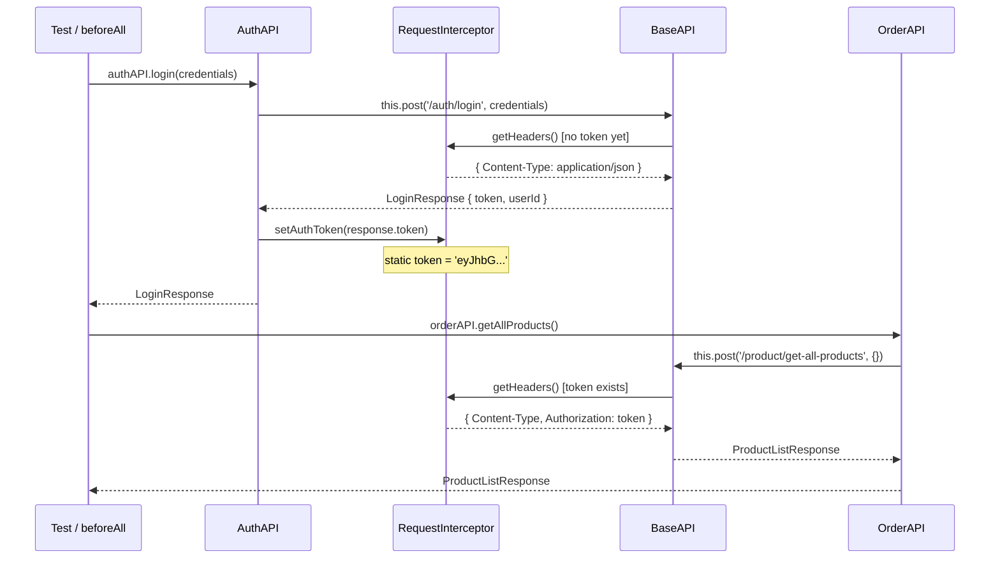

**Key**: `AuthAPI.login()` is the single point where `setAuthToken()` is called. All subsequent API calls automatically include the Authorization header.

---

## 4. UI Test Execution Flow

Traces the full method call chain from `npx playwright test` through test completion for a UI test.

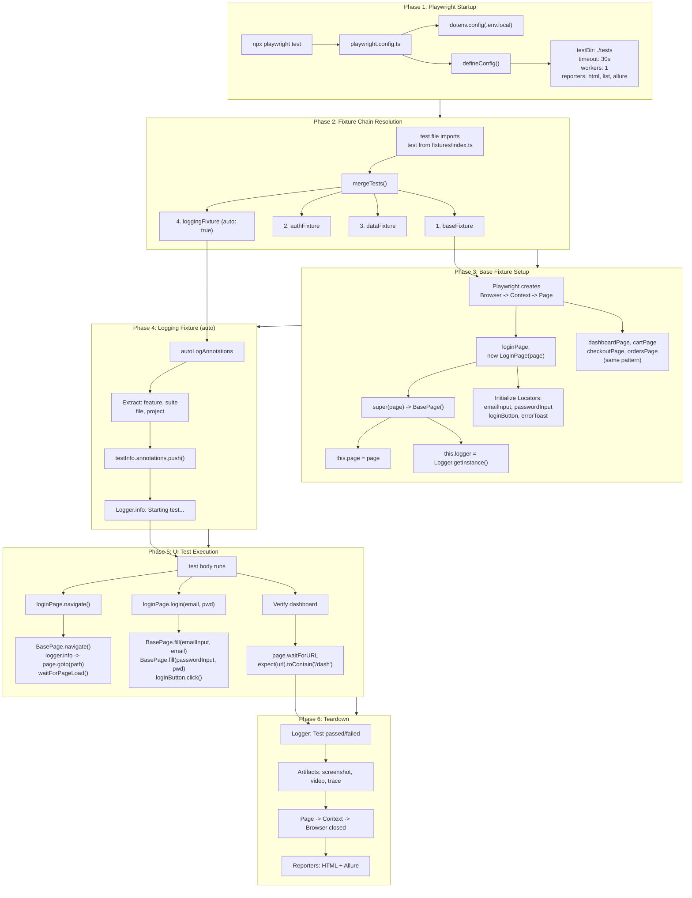

---

## 5. API Test Execution Flow

Traces the full method call chain for an API test with the interceptor pipeline.

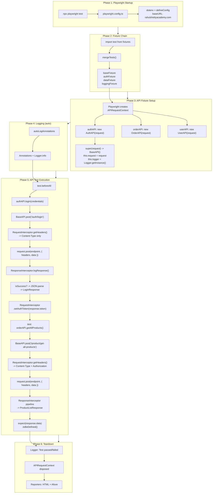

---

## 6. Fixture Dependency Graph

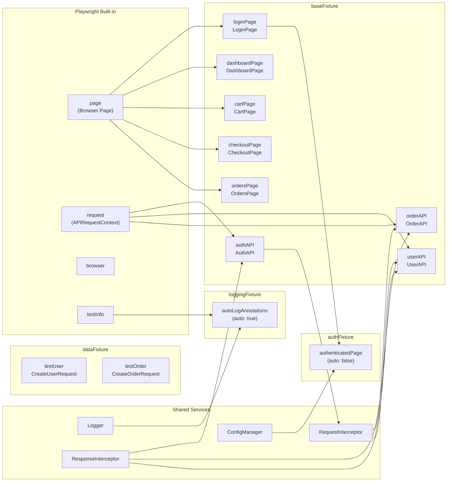

### Fixture Layers

| Order | Fixture | Auto | Provides |
|-------|---------|------|----------|
| 1 | `baseFixture` | No | `loginPage`, `dashboardPage`, `cartPage`, `checkoutPage`, `ordersPage`, `authAPI`, `userAPI`, `orderAPI` |
| 2 | `authFixture` | No | `authenticatedPage` (pre-logged-in page via UI) |
| 3 | `dataFixture` | No | `testUser`, `testOrder` (generated test data) |
| 4 | `loggingFixture` | **Yes** | Auto-annotations + start/end logging for every test |

---

## 7. Sequence Diagrams

### UI: `loginPage.login()` Call Chain

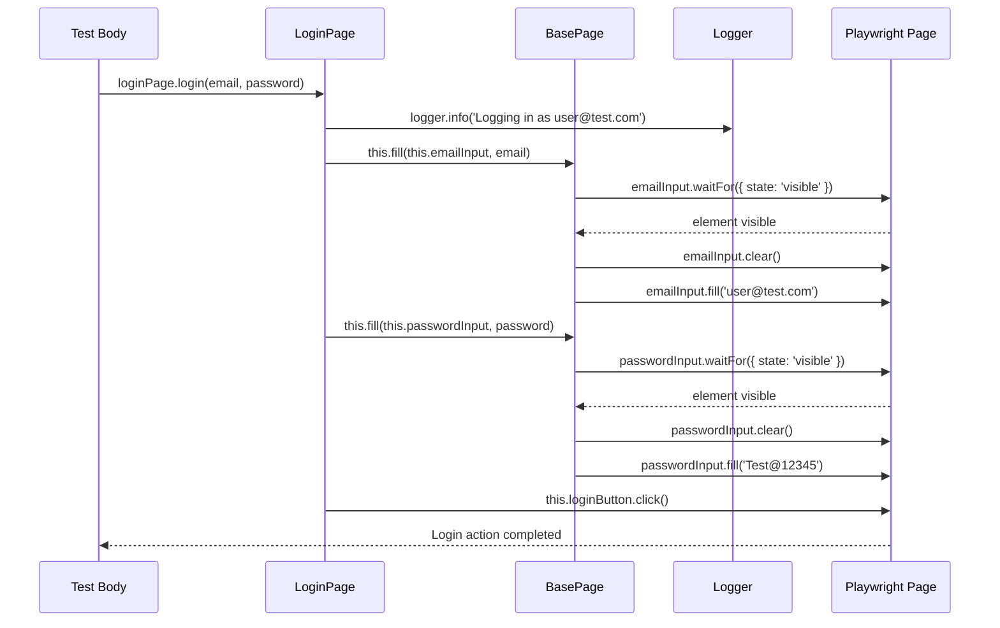

### API: `authAPI.login()` Call Chain (with Interceptors)

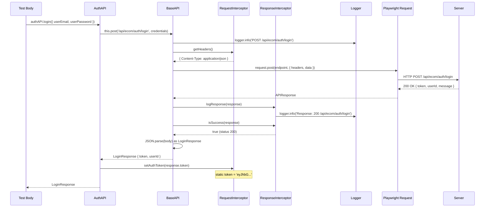

### API: `orderAPI.getAllProducts()` (After Login)

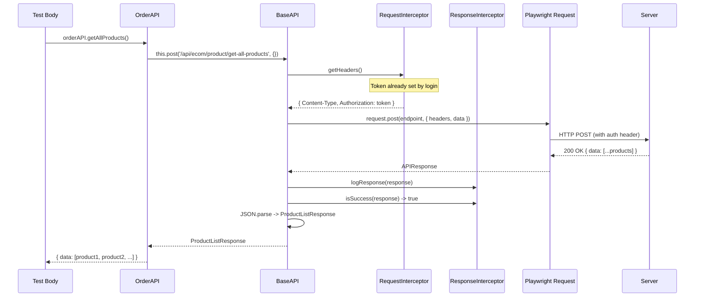

### API: Error Response Flow (4xx/5xx)

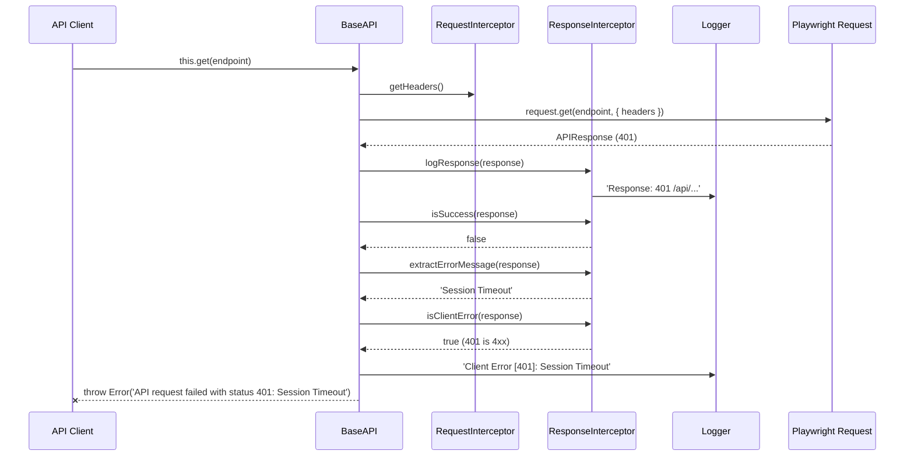

---

## 8. UI vs API Comparison

| Aspect | UI Test | API Test |
|--------|---------|----------|
| **Playwright provides** | `page` (Browser Page) | `request` (APIRequestContext) |
| **Base class** | `BasePage` (abstract) | `BaseAPI` (abstract) |
| **Constructor stores** | `this.page = page` | `this.request = request` |
| **Interaction methods** | `click()`, `fill()`, `getText()` | `get<T>()`, `post<T>()`, `delete<T>()` |
| **Auth mechanism** | Browser cookies/session | `RequestInterceptor` (static token) |
| **Request headers** | Managed by browser | `RequestInterceptor.getHeaders()` |
| **Response handling** | DOM assertions | `ResponseInterceptor` pipeline |
| **Waits for** | DOM elements | HTTP responses |
| **Returns** | Strings, booleans | Typed JSON objects (`LoginResponse`, etc.) |
| **Artifacts on failure** | Screenshots, video, trace | Logs only |
| **Browser needed?** | Yes | No |
| **Speed** | Slower (rendering) | Faster (HTTP only) |

---

## 9. Detailed Phase Breakdown

### Phase 1: Playwright Startup

When `npx playwright test` runs, Playwright reads `playwright.config.ts`:

```
playwright.config.ts
  |-- dotenv.config('.env.local')  // Load environment variables
  |-- defineConfig({
  |     testDir: './tests',
  |     timeout: 30000,
  |     workers: 1,
  |     retries: CI ? 2 : 0,
  |     reporters: ['html', 'list', 'allure-playwright'],
  |     use: {
  |       baseURL: 'https://rahulshettyacademy.com/client/',
  |       screenshot: 'only-on-failure',
  |       video: 'retain-on-failure',
  |       trace: 'on-first-retry'
  |     }
  |   })
```

### Phase 2: Fixture Resolution

Test files import `test` from `src/fixtures/index.ts`:

```typescript
export const test = mergeTests(baseFixture, authFixture, dataFixture, loggingFixture);
```

Playwright resolves which fixtures the test needs based on destructured parameters.

### Phase 3: Fixture Setup

**UI fixtures** create page objects:
```
new LoginPage(page)
  -> super(page) -> BasePage()
      -> this.page = page
      -> this.logger = Logger.getInstance()
  -> Initialize locators (lazy - no DOM queries yet)
```

**API fixtures** create API clients:
```
new AuthAPI(request)
  -> super(request) -> BaseAPI()
      -> this.request = request
      -> this.logger = Logger.getInstance()
```

### Phase 4: Logging (Auto)

Runs for every test automatically:
```
1. Extract feature name from test.describe() title
2. Determine suite type (ui/api/hybrid) from file path
3. Push annotations to testInfo
4. Log: "Starting test: 'should get all products' [order-api.spec.ts]"
```

### Phase 5: Test Execution

**UI path**: Test -> Page Object -> BasePage protected methods -> Playwright Page API
**API path**: Test -> API Client -> BaseAPI protected methods -> Interceptors -> Playwright Request API

### Phase 6: Teardown

```
1. Logging fixture: "Test passed (1234ms)" or "Test failed (5678ms)"
2. Playwright captures artifacts (screenshot, video, trace) based on config
3. Resources cleaned up: Page -> Context -> Browser (UI) or APIRequestContext (API)
4. Reporters generate output: HTML + Allure + console
```

### Singleton Initialization

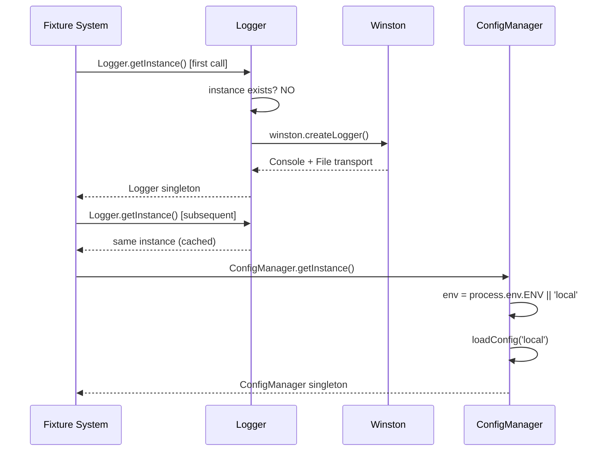

---

## Folder Structure Reference

```
playwright-framework/
  playwright.config.ts           # Global config + environment loading
  src/
    fixtures/
      index.ts                   # mergeTests(base, auth, data, logging)
      base.fixture.ts            # Page objects + API clients
      auth.fixture.ts            # Pre-authenticated page
      data.fixture.ts            # Test data (testUser, testOrder)
      logging.fixture.ts         # Auto-annotations + logging
    pages/
      BasePage.ts                # Abstract: navigate, click, fill, getText
      LoginPage.ts               # Login form interactions
      DashboardPage.ts           # Product listing + cart
      CartPage.ts                # Cart review + checkout
      CheckoutPage.ts            # Country selection + place order
      UserProfilePage.ts         # Orders page
    api/
      clients/
        AuthAPI.ts               # login() [sets token], register()
        UserAPI.ts               # registerUser(), getUserDetails()
        OrderAPI.ts              # getAllProducts(), createOrder(), etc.
      interceptors/
        RequestInterceptor.ts    # Static token + header management
        ResponseInterceptor.ts   # Response logging + error classification
      models/
        AuthModels.ts            # LoginRequest/Response, RegisterRequest/Response
        UserModels.ts            # CreateUserRequest, UserResponse
        OrderModels.ts           # Product, Order, CreateOrderRequest/Response
    core/
      base/
        BaseAPI.ts               # Abstract: HTTP methods + interceptor integration
        BasePage.ts              # Abstract: page interactions
        BaseComponent.ts         # Abstract: reusable UI components
      logger/
        Logger.ts                # Winston singleton (console + file)
      config/
        ConfigManager.ts         # Environment-specific config singleton
    services/
      UserService.ts             # Facade combining UI + API user flows
    utils/
      constants/                 # ErrorMessages, Routes, Selectors
      decorators/                # retry, step decorators
      helpers/                   # DateHelper, StringHelper, WaitHelper
      types/                     # custom-types, global.d.ts
    data/
      factories/                 # TestDataFactory
      test-data.ts               # Static test data (credentials, products)
  tests/
    ui/                          # UI-only tests (login, dashboard)
    api/                         # API-only tests (auth, user, order)
    hybrid/                      # E2E combining UI + API
```
